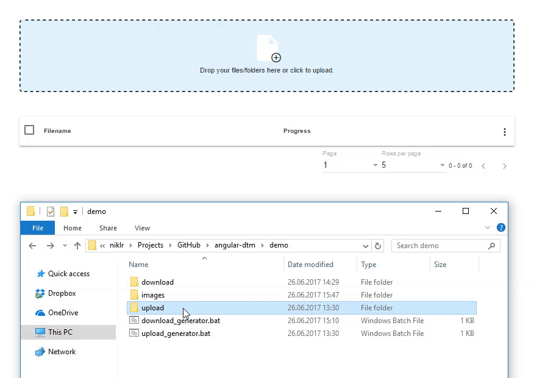
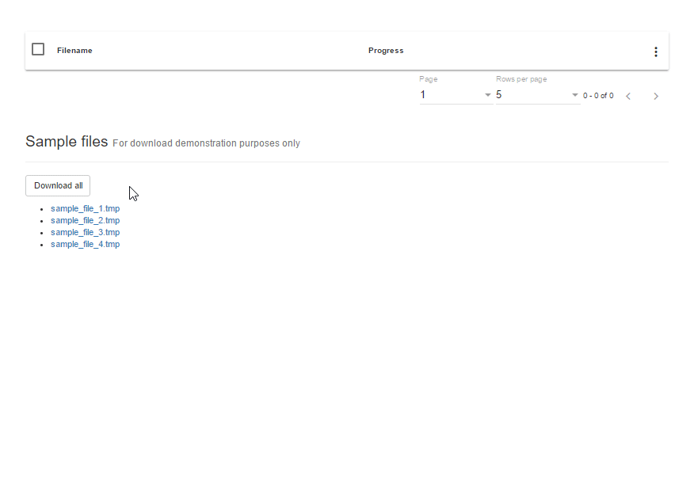
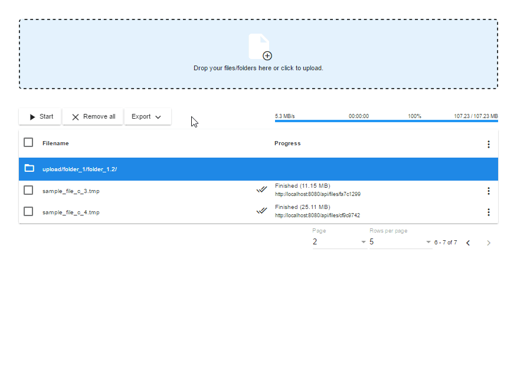
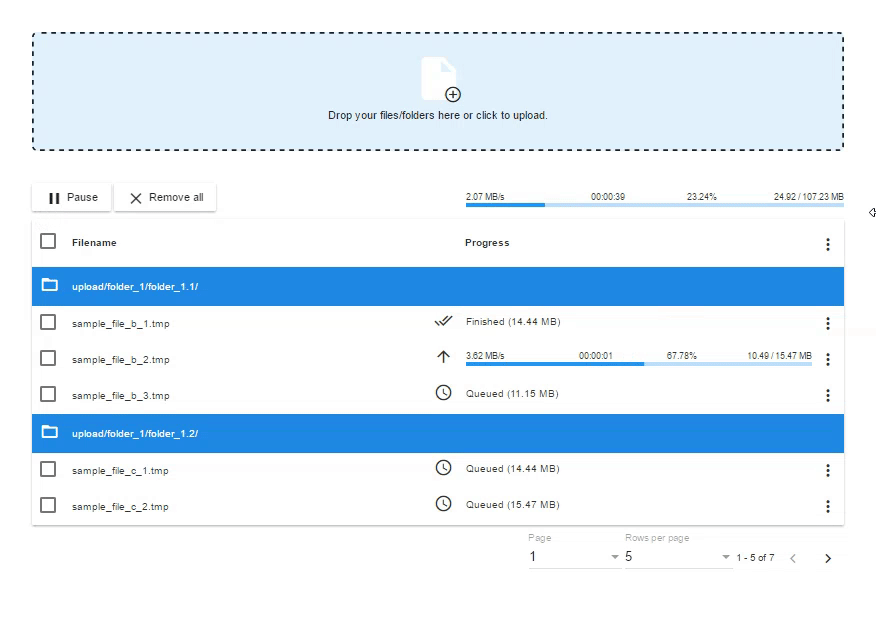
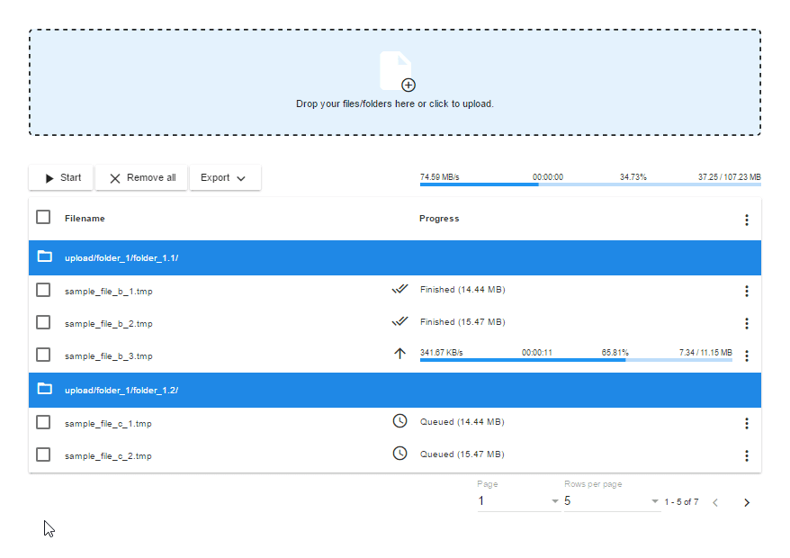

angular-material-datatransfer
=========

Demo: https://niklr.github.io/angular-material-datatransfer/

angular-material-datatransfer is an application which combines the upload and download of multiple simultaneous files in a unified user interface. 
The application is explicitly designed for modern browsers supporting advanced [`HTML5 File API`](http://www.w3.org/TR/FileAPI/) features.

The unified user interface is built on top of Google's [Material Design](https://material.io) implemented by [Angular Material](https://material.angular.io/) using [Angular](https://angular.io/). Material Design by Google's definition is a visual language that synthesizes the classic principles of good design with the innovation and possibility of technology and science.

For multiple simultaneous uploads the open-source library called [Resumable.js](https://github.com/23/resumable.js/) is used.
Resumable.js introduces fault-tolerance into the upload of large files through HTTP. This is done by splitting each file into small chunks. Then, whenever the upload of a chunk fails, uploading is retried until the procedure completes. This allows uploads to automatically resume uploading after a network connection is lost either locally or to the server. Additionally, it allows for users to pause, resume and even recover uploads without losing state because only the currently uploading chunks will be aborted, not the entire upload.

For multiple simultaneous downloads the open-source library called [FileSaver.js](https://github.com/eligrey/FileSaver.js/) is used.
FileSaver.js implements the `saveAs()` FileSaver interface in browsers that do not natively support it.

Table of Content:
* [Basic setup](#basic_setup)
* [Handling download](#handling_download)
* [Events](#events)
* [Configuration](#configuration)
* [Server-side setup](#server_setup)

## Upload
<kbd>
  
</kbd>

## Download
<kbd>
  
</kbd>

## Export
<kbd>
  
</kbd>

## Responsive
<kbd>
  
</kbd>

## Customizable
<kbd>
  
</kbd>

## Basic setup <a name="basic_setup"></a>

```html
<!doctype html>
<html>

<head>
  <meta charset="utf-8">
  <link rel="stylesheet" href="https://fonts.googleapis.com/icon?family=Material+Icons">
  <link rel="stylesheet" href="css/angular-material.css">
  <link rel="stylesheet" href="css/angular-material-datatransfer.css">
</head>

<body>
  <angular-material-datatransfer>Loading...</angular-material-datatransfer>

  <script type="text/javascript" src="js/angular-material-datatransfer.min.js"></script>

  <script type="text/javascript">
    (function () {
        var config = {
          core: {
            showUploadDropzone: false
          },
          resumablejs: {
            simultaneousUploads: 2
          }
        };
        var event = new CustomEvent('github:niklr/angular-material-datatransfer.create', { 'detail': config });
        document.dispatchEvent(event);
    })();
  </script>

</body>
</html>
```

## Handling download <a name="handling_download"></a>
The download of a file can be triggered by dispatching a custom event called `github:niklr/angular-material-datatransfer.download-item` on the document object. Data can be passed as detail object with the following properties.
* `filename` The name of the file to be downloaded.
* `url` The URL of the file to be downloaded.
* `size` The size in bytes of the file to be downloaded. 

```js
var eventDetail = { 
  'filename': filename, 
  'url': url, 
  'size': size 
};
var event = new CustomEvent('github:niklr/angular-material-datatransfer.download-item', { 'detail': eventDetail });
document.dispatchEvent(event);
```

## Events <a name="events"></a>
After initialization, interaction with angular-material-datatransfer is done by listening to events:

```js
document.addEventListener('github:niklr/angular-material-datatransfer.upload-completed', function (e) { ... });
```

* `github:niklr/angular-material-datatransfer.upload-completed` Indicates that the overall upload has been completed.
* `github:niklr/angular-material-datatransfer.download-completed` Indicates that the overall download has been completed.

## Configuration <a name="configuration"></a>
In order to initialize and configure angular-material-datatransfer, a custom event called `github:niklr/angular-material-datatransfer.create` can be dispatched on the document object. The configuration differentiates between `core` and `resumablejs`. Both are described below. 

```js
var config = {
  core: {
    ...
  },
  resumablejs: {
    ...
  }
};
var event = new CustomEvent('github:niklr/angular-material-datatransfer.create', { 'detail': config });
document.dispatchEvent(event);
```

### Core configuration
* `showUploadDropzone` Indicates if the built-in dropzone element enabling the user to drop folders/files to be uploaded should be shown. (Default: `'true'`)
* `uploadBrowseElementId` The identifier of the element enabling the user to add files to be uploaded. (Default: `undefined`)
* `uploadDropElementId` The identifier of the element enabling the user to drop folders/files to be uploaded. (Default: `undefined`)
* `paginationRppOptions` The pagination options containing the numbers defining how many results should be shown per page. (Default: `[5, 10, 25]`)
* `simultaneousDownloads` Number of simultaneous downloads. (Default: `2`)
* `downloadMethod` HTTP method to use when downloading from the server (`GET`, `POST`, `PUT`, `PATCH`). (Default: `GET`)
* `checkHashModule` Indicates if the built-in hash check module should be added. (Default: `'false'`)
* `checkHashEnabled` Indicates if the built-in hash check should be enabled. (Default: `'true'`)
* `checkHashTarget` The target URL for the GET request to the server for each file to see if it already exists based on the in-browser calculated hash. This can be a `string` or a `function` that allows you you to construct and return a value, based on supplied `params`. (Default: `https://httpbin.org`)
* `checkHashMethod` HTTP method to use when sending file hash check requests. (Default: `'GET'`)
* `checkHashParameterName` The name of the check hash request parameter. (Default: `'hash'`)
* `checkHashFunctionName` The name of the hash function to be used in the built-in hash check. (`sha1`, `md5`) (Default: `'sha1'`)
* `checkHashEncodingName` The name of the encoding scheme to be used in the built-in hash check. (`latin1`, `hex`, `base64`, `utf8`) (Default: `'hex'`)
* `checkHashInputEncodingName` The name of the input encoding scheme to be used in the built-in hash check. (`latin1`, `hex`, `base64`, `utf8`) (Default: `'latin1'`)

### Resumablejs configuration
* `target` The target URL for the multipart POST request. This can be a `string` or a `function` that allows you you to construct and return a value, based on supplied `params`. (Default: `https://httpbin.org`)
* `testTarget` The target URL for the GET request to the server for each chunk to see if it already exists. This can be a `string` or a `function` that allows you you to construct and return a value, based on supplied `params`. (Default: `null`)
* `chunkSize` The size in bytes of each uploaded chunk of data. The last uploaded chunk will be at least this size and up to two the size, see [Issue #51](https://github.com/23/resumable.js/issues/51) for details and reasons. (Default: `1*1024*1024`)
* `forceChunkSize` Force all chunks to be less or equal than chunkSize. Otherwise, the last chunk will be greater than or equal to `chunkSize`. (Default: `false`)
* `simultaneousUploads` Number of simultaneous uploads (Default: `3`)
* `fileParameterName` The name of the multipart request parameter to use for the file chunk  (Default: `file`)
* `chunkNumberParameterName` The name of the chunk index (base-1) in the current upload POST parameter to use for the file chunk (Default: `resumableChunkNumber`)
* `totalChunksParameterName` The name of the total number of chunks POST parameter to use for the file chunk (Default: `resumableTotalChunks`)
* `chunkSizeParameterName` The name of the general chunk size POST parameter to use for the file chunk (Default: `resumableChunkSize`)
* `totalSizeParameterName` The name of the total file size number POST parameter to use for the file chunk (Default: `resumableTotalSize`)
* `identifierParameterName` The name of the unique identifier POST parameter to use for the file chunk (Default: `resumableIdentifier`)
* `fileNameParameterName` The name of the original file name POST parameter to use for the file chunk (Default: `resumableFilename`)
* `relativePathParameterName` The name of the file's relative path POST parameter to use for the file chunk (Default: `resumableRelativePath`)
* `currentChunkSizeParameterName` The name of the current chunk size POST parameter to use for the file chunk (Default: `resumableCurrentChunkSize`)
* `typeParameterName` The name of the file type POST parameter to use for the file chunk (Default: `resumableType`)
* `query` Extra parameters to include in the multipart request with data. This can be an object or a function. If a function, it will be passed a ResumableFile and a ResumableChunk object (Default: `{}`)
* `testMethod` Method for chunk test request. (Default: `'GET'`)
* `uploadMethod` HTTP method to use when sending chunks to the server (`POST`, `PUT`, `PATCH`) (Default: `POST`)
* `parameterNamespace` Extra prefix added before the name of each parameter included in the multipart POST or in the test GET. (Default: `''`)
* `headers` Extra headers to include in the multipart POST with data. This can be an `object` or a `function` that allows you to construct and return a value, based on supplied `file` (Default: `{}`)
* `method` Method to use when sending chunks to the server (`multipart` or `octet`) (Default: `multipart`)
* `prioritizeFirstAndLastChunk` Prioritize first and last chunks of all files. This can be handy if you can determine if a file is valid for your service from only the first or last chunk. For example, photo or video meta data is usually located in the first part of a file, making it easy to test support from only the first chunk. (Default: `false`)
* `testChunks` Make a GET request to the server for each chunks to see if it already exists. If implemented on the server-side, this will allow for upload resumes even after a browser crash or even a computer restart. (Default: `true`)
* `preprocess` Optional function to process each chunk before testing & sending. Function is passed the chunk as parameter, and should call the `preprocessFinished` method on the chunk when finished. (Default: `null`)
* `generateUniqueIdentifier(file, event)` Override the function that generates unique identifiers for each file. May return [Promise](https://developer.mozilla.org/en/docs/Web/JavaScript/Reference/Global_Objects/Promise)-like object with `then()` method for asynchronous id generation. Parameters are the ES `File` object and the event that led to
adding the file. (Default: `null`)
* `maxFiles` Indicates how many files can be uploaded in a single session. Valid values are any positive integer and `undefined` for no limit. (Default: `undefined`)
* `maxFilesErrorCallback(files, errorCount)` A function which displays the *please upload n file(s) at a time* message. (Default: displays an alert box with the message *Please n one file(s) at a time.*)
* `minFileSize` The minimum allowed file size.  (Default: `undefined`)
* `minFileSizeErrorCallback(file, errorCount)` A function which displays an error a selected file is smaller than allowed. (Default: displays an alert for every bad file.)
* `maxFileSize` The maximum allowed file size.  (Default: `undefined`)
* `maxFileSizeErrorCallback(file, errorCount)` A function which displays an error a selected file is larger than allowed. (Default: displays an alert for every bad file.)
* `fileType` The file types allowed to upload. An empty array allow any file type. (Default: `[]`)
* `fileTypeErrorCallback(file, errorCount)` A function which displays an error a selected file has type not allowed. (Default: displays an alert for every bad file.)
* `maxChunkRetries` The maximum number of retries for a chunk before the upload is failed. Valid values are any positive integer and `undefined` for no limit. (Default: `undefined`)
* `chunkRetryInterval` The number of milliseconds to wait before retrying a chunk on a non-permanent error.  Valid values are any positive integer and `undefined` for immediate retry.  (Default: `undefined`)
* `withCredentials` Standard CORS requests do not send or set any cookies by default. In order to include cookies as part of the request, you need to set the `withCredentials` property to true. (Default: `false`)
* `xhrTimeout` The timeout in milliseconds for each request (Default: `0`)

## Server-side setup <a name="server_setup"></a>
Most of the magic happens in the user's browser, but files still need to be reassembled from chunks on the server side. This should be a fairly simple task, which and can be achieved using any web framework or language that is capable of handling file uploads.

To handle the state of upload chunks, a number of extra parameters are sent along with all requests:

* `resumableChunkNumber`: The index of the chunk in the current upload. First chunk is `1` (no base-0 counting here).
* `resumableTotalChunks`: The total number of chunks.
* `resumableChunkSize`: The general chunk size. Using this value and `resumableTotalSize` you can calculate the total number of chunks.
* `resumableCurrentChunkSize`: The current chunk size. Please note that this value might be lower or higher than `resumableChunkSize` for the last chunk of a file.
* `resumableTotalSize`: The total file size.
* `resumableIdentifier`: A unique identifier for the file contained in the request.
* `resumableFilename`: The original file name (since a bug in Firefox results in the file name not being transmitted in chunk multipart posts).
* `resumableRelativePath`: The file's relative path when selecting a directory (defaults to file name in all browsers except Chrome).

You should allow for the same chunk to be uploaded more than once; this isn't standard behaviour, but on an unstable network environment it could happen.

For every request, you can confirm reception in HTTP status codes (can be change through the `permanentErrors` option):

* `200`: The chunk was accepted and correct. No need to re-upload.
* `400`, `404`, `405`, `415`, `501`: The file for which the chunk was uploaded is not supported, cancel the entire upload.
* _Anything else_: Something went wrong, but try reuploading the file.